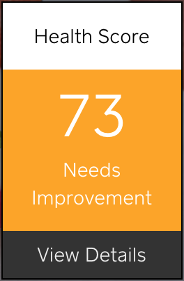
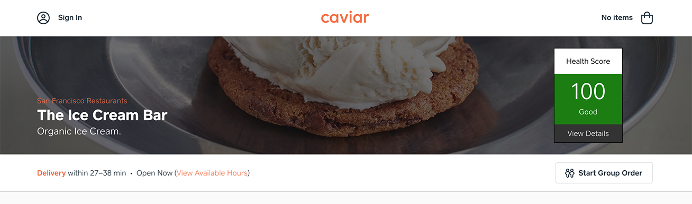
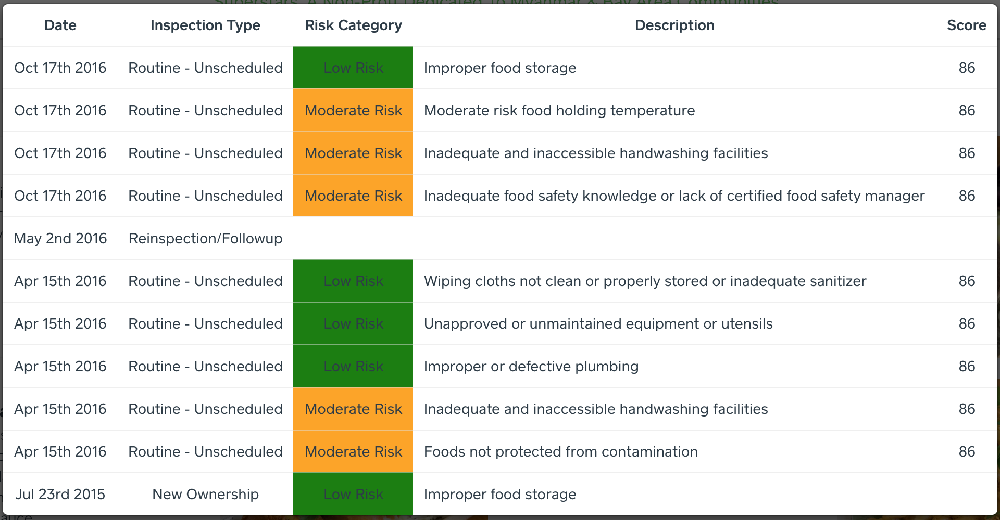

#  Health Inspector
A Chrome Extension that puts health scores and health inspection info for restaurants directly onto the web pages of popular food/delivery ordering websites.

## FAQ:
* What region is the extension available in?
  * San Francisco
* Where does the health inspection data come from?
  * The LIVES Standard dataset released by the San Francisco Department of Public Health.
* What do the inspection categories mean?
  * The numeric scores and the category labels (Good, Adequate, Needs Improvement, and Poor) come from the San Francisco Department of Public Health. A page with a descriptions of the terms is [available here](https://www.sfdph.org/dph/EH/Food/Score/default.asp).
* What services/websites are currently supported?
  * Caviar
  * Postmates

## Future Work:
* Adding additional delivery service websites.
* Add additional regions (particularly ones that conform to the same LIVES standard).
* Caching to improve load times.
* Improve disambiguation for restaurant chains with multiple addresses, particularly on platforms that make it hard to access street address/neighborhood information.
* Cosmetic improvements

## Screenshots:

